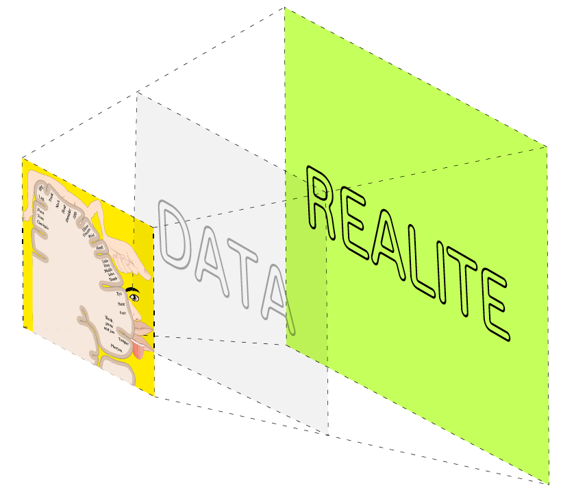
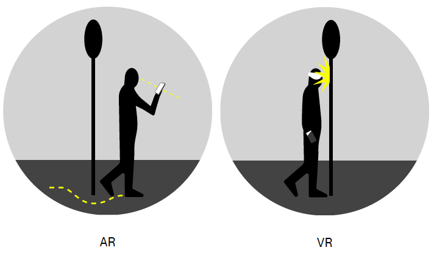
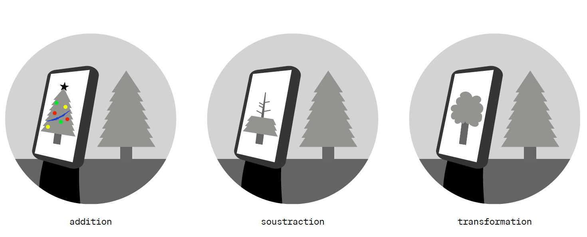
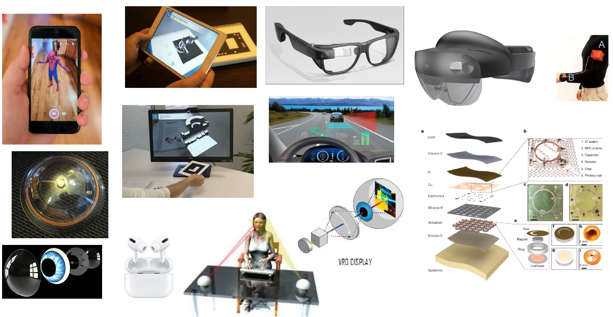
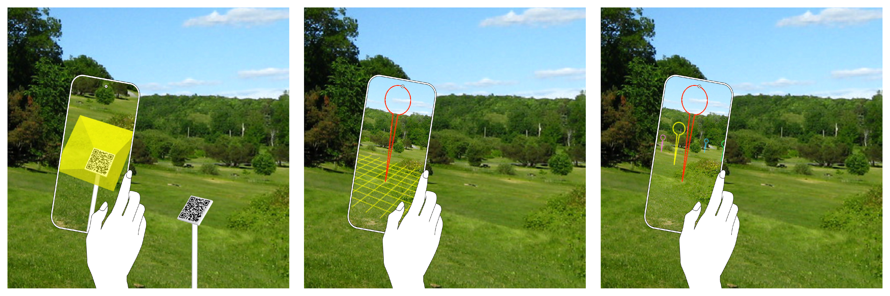

# Introduction à la RA

## Table des matières <!-- omit in toc -->

- [Introduction à la RA](#introduction-à-la-ra)
  - [Principes de la RA](#principes-ra)
  - [Typologie](#typologie-ra)
    - [Par degré de «virtualité»](#virtualité)
    - [Par périphérique](#périphérique)
    - [Par méthode de tracking](#méthode-tracking)
		1. [Marker-based AR](#marker-based-ar)
		2. [Markerless AR](#markerless-ar)
		3. [Location-based AR](#location-based-ar)
		4. [Superimposition-based AR](#superimposition-based-ar)
		5. [Projection-based AR](#projection-based-ar)
		
  - [Problématiques d’utilisabilité VR vs RA](#problematiques)
    - [Cinétose](#cinetose)
    - [Précision](#precision)
    - [Interactions](#interactions)
  - [Résumé](#résumé)
  - [Références](#références)

## <a name="principes-ra">Principes de la RA</a>
|  | 
|:--:| 
| *Une interface de RA est un espace informationnel qui consiste à superposer des objets virtuels à la réalité* |

Conceptuellement, la RA se distingue de la VR par la proportion d’éléments virtuels qu’elle comprend par rapport aux éléments réels: en VR, l’entier du champ de vision est recouvert par des éléments visuels (ciel, background, objets…): ils **occluent** la partie visible de la réalité, même si les éléments réels (le sol, les murs…) restent perceptibles sur par les autres modalités sensorielles que la vision (toucher, odorat). L’ouïe peut ou non être occluse selon qu’on utilise des écouteurs en plus du casque. En RA, une grande partie d’objets réels resteront visibles: sur une tablette, on aura généralement une vue caméra en fond; sur des lunettes, on verra la réalité à travers un écran transparent. L’exercice consiste à **augmenter** cette réalité perçue en y ajoutant des objets virtuels. Cela offre des possibilités intéressantes en interaction humain-machine (IHM), puisque cela permet d’imaginer des systèmes où toutes les connaissances relatives à un objet donné sont visibles en parallèle, dans un même **espace informationnel**. 

|  | 
|:--:| 
| *En VR, le champ visuel est entièrement occulté par les objets virtuels. En RA, la réalité continue d’occuper l’essentiel du champ de vision* |

Pour exploiter au mieux les affordances de la RA, on va essayer de donner à ces éléments une cohérence avec le monde réel qui les entoure, ce qui introduit des difficultés techniques de mise en œuvre, puisqu’il faut alors connaître et mesurer avec précision ce monde réel. 

|  | 
|:--:| 
| *En RA, la notion d’**ancrage** à la réalité et sa précision sont essentiels* |

## <a name="typologie-ra">Typologie</a>
### <a name="virtualité">Par degré de «virtualité»</a>
Il existe une grande variété de modalités pour faire de la RA ou de la VR, qui s’inscrivent sur le «continuum de la virtualité» proposé par Milgram et Kishino en 1994 [^1].
Il débute dans l’environnement réel et finirait sur un (théorique) environnement 100% virtuel (à la Matrix) ou l’ensemble de nos perceptions serait simulé de telle sorte qu’il serait impossible de percevoir la différence avec la réalité.  

|  | 
|:--:| 
| *Le continuum «Réel-Virtuel» (adapté de (Milgram et al., 1994))* |

### <a name="périphérique">Par périphérique</a>
|  | 
|:--:| 
| *La RA peut être déployée sur différents périphériques, du smartphone aux lunettes (pour la modalité visuelle)* |

Au sein des interfaces qualifiées de RA, il existe une variété de types, qui peuvent être catégorisés selon les périphériques utilisés : lunettes, casque (“head-mounted-display”); smartphone, tablette (“hand-held”); tabletop AR (“projection-based”), head-up display (pare-brise de véhicule)… Ces catégories sont dynamiques et évoluent rapidement au gré des innovations. 

### <a name="méthode-tracking">Par méthode de tracking</a>
Il existe également une catégorisation selon les méthodes utilisées pour faire le suivi de position: 
||
|:--:| 
| *1. Marker-based AR; 2. Markerless AR (SLAM); 3. Location-based AR* |

#### <a name="marker-based-ar">1. Marker-based AR</a> 
Marker-based AR: lorsqu’on a recours à des algorithmes de vision par ordinateur pour faire de la reconnaissance de motif, ce qui permet de transformer des pixels en coordonnées 3D locales. L’exemple le plus connu est celui des QR codes, mais d’autres motifs (y compris invisibles, ou basés sur des modèles 3D) sont possibles. Il est possible avec cette technique d’ancrer des points d’intérêt à un objet appartenant au «monde réel», en plaçant une balise à l’endroit voulu. L’avantage de cette approche est sa précision (~<1mm). Son désavantage principal est la nécessité d’avoir un relai physique dans le monde réel, qui doit également être connu en amont de l’expérience. 

#### <a name="markerless-ar">2.	Markerless AR</a>
lorsque l’environnement réel est mappé (=«scan 3D») en posant automatiquement des ancres sur des éléments visuels saillants (angles, plans…), formant ainsi des nuages de points aux caractéristiques uniques. Une fois «mappé», on peut poser des objets virtuels dans cet environnement 3D. Lorsqu’on se déplace, l’algorithme (de type SLAM) tracke les points/ancres et en infère le déplacement du périphérique. L’avantage de cette méthode est sa précision (~<1mm). Son désavantage principal est la nécessité de «mapper» l’environnement réel ciblé, et donc l’impossibilité de concevoir des environnements à distance et en avance. Les points d’intérêt ne peuvent a priori pas être ancrés à un objet du «monde réel», car les nuages de points ne sont pas ancrés à un système de coordonnées globales. De telles combinaisons existent, notamment dans le Visual Positioning System (VPS) développé par Google, basé sur des nuages de points massifs issus des données initialement créées pour le système Google Street Maps.

#### <a name="location-based-ar">3. Location-based AR</a>
lorsqu’on utilise un système de coordonnées géographiques pour attribuer leur position à des points d’intérêt. Le périphérique mobile détermine sa position grâce à un capteur GNSS. Une conversion (haversine) est effectuée pour déterminer la distance et l’orientation entre la position du périphérique et celle du point d’intérêt, ce qui permet de l’afficher dans l’interface à la position voulue. Avec cette technique, il est possible d’ancrer des points d’intérêt à des objets appartenant au «monde réel», pour autant que ses coordonnées géographiques soient connues. Le principal avantage est la possibilité de concevoir des environnements à distance, en utilisant par exemple des bases de géodonnées existantes. Les principaux désavantages sont le manque de précision, lié à l’imprécision des capteurs embarqués (GNSS et magnétomètre), l’impossibilité d’avoir recours à la coordonnée Z (l’altitude étant encore moins précise que les longitude et latitude), la limitation à une utilisation en extérieur, dans un environnement dégagé… 

#### <a name="superimposition-based-ar">4. Superimposition-based AR</a>
Le principe repose sur la reconnaissance d’un motif, à la façon d’un QR-code, mais avec une possibilité de généraliser (de reconnaître un visage sur la tête de tout individu, par exemple) et de mapper en 3D le contenu virtuel sur l’objet 3D detecté. Cette méthode est utilisée pour réaliser des filtres (Instagram, Snapchat…). 

#### <a name="projection-based-ar">5. Projection-based AR</a>
Dans cette méthode, l’environnement virtuel est fixe (par exemple, sur une table) et les objets virtuels sont projetés par un projecteur. Les interactions sont rendues possibles par une caméra qui détecter la profondeur et les mouvements.

## <a name="problematiques">Problématiques d’utilisabilité VR vs RA</a>

### <a name="cinetose">En VR: la cinétose</a>
En VR, le principal défi d’utilisabilité est lié à la **cinétose**, soit le «mal de mer» provoqué par une dissonance entre le mouvement de l’utilisateur et celui du monde virtuel avec lequel il interagit. En RA, ce n‘est pas vraiment un problème, puisque la présence dominante de «la réalité» ne permet pas au cerveau de percevoir cette dissonance dans l’interaction avec les objets virtuels: on perçoit principalement le monde réel, qui continue à agir selon les règles physiques auxquelles notre cerveau est habitué. 

### <a name="precision">En RA: la précision de l’ancrage</a>
En RA, la problématique d’utilisabilité principale est liée à la **précision** et la cohérence temporelle de l’ancrage des objets virtuels. Il faut que les éléments virtuels «suivent» le monde réel avec beaucoup de précision, car lorsqu’il y a un décalage avec la réalité, l’illusion d’appartenance de ces objets à la réalité–l’intérêt principal des interfaces de RA–est annulée, ce qui «brise» constamment le 4ème mur et cause de la frustration. A contrario, la VR peut tolérer certains décalages sur l’ancrage de l’environnement virtuel à la réalité, puisque celle-ci n’est pas visible. 

### <a name="interaction">Interactions naturelles</a>
L’une des propositions fortes de la RA comme de la VR est l’implémentation d’**interactions naturelles** (direction du regard, mouvement des mains…). Cependant, dans le cas de la RA “hand-held”–soit lorqu’on utilise un périphérique mobile–celles-ci sont rendues quasi impossible, les mains étant utilisées pour tenir la tablette ou le smartphone et pour interagir avec (de façon traditionnelle, en touchant l’écran). Pour cette raison, il est encore difficile d’appliquer la RA à des usages autres que la visualisation de contenus, ce qui rend les interactions très passives et limite son intérêt. 

## <a name="résumé">Résumé:</a>
En résumé : 
- En VR : 
 - On crée un monde virtuel «complet» 
 - Cela autorise une certaine marge de manœuvre dans la précision des données spatiales
 - Un délai infime ou un mouvement soudain peut créer de la cinétose…
 - …Car l’immersion a un impact important sur les perceptions
 - On est généralement limité dans ses déplacements, en intérieur
- En RA :
 - On superpose des éléments virtuels sur «la réalité» (ou un de ses substrats, tel qu’une vue caméra)
 - Cette superposition exige une grande précision dans les données
 - Des délais ou des mouvements ne risquent pas de créer de cinétose…
 - …Car l’immersion est légère, et n’a qu’un impact limité sur les perceptions cognitives
 - On peut imaginer des usages intérieurs ou extérieurs, voire hybrides

## <a name="references">références:</a>
[^1]: Milgram, P.; Kishino, F. A taxonomy of mixed reality visual displays. IEICE Trans. Inf. Syst. 1994,77, 1321–1329.

---
[Chapitre suivant : Exercices pratiques de RA avec A-Frame](pratique-RA.md)
---
