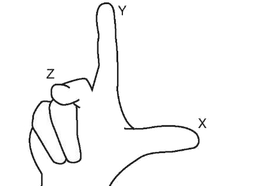

# Bases de A-Frame

A-Frame est un framework web open-source dédié au développement d'expériences en réalité virtuelle et augmentée. Basé sur HTML et Three.js, il permet facilement de créer du contenu en VR.

## Table des matières <!-- omit in toc -->

- [Bases de A-Frame](#bases-de-a-frame)
  - [Architecture](#architecture)
  - [Entité](#entité)
  - [Scène](#scène)
    - [Support caméra](#support-caméra)
  - [Composant](#composant)
    - [Enregistrer un composant](#enregistrer-un-composant)
  - [Système](#système)
    - [Enregistrer un système](#enregistrer-un-système)
  - [Interactions et événements](#interactions-et-événements)
  - [Gestion d'assets](#gestion-dassets)
  - [Inspecteur visuel](#inspecteur-visuel)

## Architecture

A-Frame adopte une architecture Entity-Component-System. Ce modèle se compose des 3 éléments suivants :

- **Entité** : conteneur permettant d'accueillir des composants. Sans composant, les entités ne sont pas rendues, à l'image de `
` vides.

- **Composant** : module réutilisable attachable à des entités, pour leur donner une apparence, un comportement ou une fonctionnalité.
- **Système** : module qui permet de gérer des données globales, des services et des classes pour les composants. Si souhaité, il permet également de séparer la logique (système) des données (composant).

Si l'on prend pour exemple un smartphone comme entité, ses composants définiront son apparence (forme, couleur), son comportement (sonner quand on reçoit un appel) et ses fonctionnalités (appel, appareil photo). Le dispositif peut également comprendre un système pour la gestion des comportements liés aux appels.

Plus concrétement, ces éléments sont intégrer comme suit dans A-Frame.

## Entité

La syntaxe de base d'une entité se rapproche d'une balise HTML :

    <a-entity></a-entity>

Il existe cependant des éléments de base préconstruits, appelés _primitives_, qui permettent de construire facilement une scène sans devoir plonger dans l'architecture sous-jacente. On retrouve notamment des éléments tels que `a-box`, `a-sphere` ou même `a-sky`.

Consultez la doc pour parcourir les primitives existantes (en bas du menu) ou créer des [primitives personnalisées](https://aframe.io/docs/1.5.0/introduction/html-and-primitives.html#registering-a-primitive).

## Scène

Une scène est construite avec l'entité `<a-scene>` dans le `<body>` d'une fichier HTML. Elle constitue l'élément racine de toute entité. Elle comprend une caméra `<a-camera>` et des lumières `<a-light>` par défaut, qui sont remplacés si l'on déclare explicitement ces primitives.

On prend, par exemple, une primitive `<a-box>` qui fait apparaître une boîte dans la scène.

    <a-scene>
        <a-box color="red" rotation="0 45 45" scale="2 2 2"></a-box>
    </a-scene>

Une entité placée à l'intérieur d'une autre hérite de ses transformations (position, scale, rotation, etc.) Dans l'exemple suivant, la sphère aura la même position, la même rotation et la même échelle que la boîte parente.

> [!IMPORTANT]
> Si l'on transforme l'entitée enfant, le point de départ de ses transformations est celui de l'entité parente.

    <a-scene>
        <a-box position="0 2 0" rotation="0 45 45" scale="2 4 2">
            <a-sphere></a-sphere>
        </a-box>
    </a-scene>

Le positionnement des entités se fait à partir d'un système de coordonnée basé sur la main droite. Les valeurs positives vont donc à droite (X), en haut (Y) et contre nous (Z).

### Support caméra

Ce système d'héritage requiert ainsi de placer la caméra et les mains dans une sorte de support (camera rig), une entité parente, qui assurera la cohérence dans les déplacements et rotation de ces éléments.

## Composant

Les composants sont attachés aux entités comme des attributs sur des éléments HTML.

    <a-entity position="0 0 1"></a-entity>

Selon leur nature, ils peuvent accueillir des données sous forme de propriétés.

> ### :computer: Exercice
> Insérer une primitive `<a-box>` dans votre scène. Placez-là devant vous et donner lui une couleur de votre choix.
> 

### Enregistrer un composant

Afin d'illustrer les différentes partie d'un composant et leurs fonctions, on va créer un composant `box`.

Dans un premier temps, on enregistre un composant avec la fonction suivante :

        AFRAME.registerComponent('box', {
            // code
        })

On utilise un `schema` pour enregistrer des propriétés qui peuvent être transmise par l'entité.

> [!NOTE]
> Les unités sont en mètres.

    AFRAME.registerComponent('box', {
        schema: {
            width: {type: 'number', default: 1},
            height: {type: 'number', default: 1},
            depth: {type: 'number', default: 1},
            color: {type: 'color', default: '#AAA'}
        },
    });

Les propriétés multiples sont passées ainsi :

    <a-entity box="width: 2; height: 3"></a-entity>

La fonction `init` est appelée une seule fois, lors de l'initialisation du composant. Pour `box`, l'objet 3D est créé avec three.js. Consultez le [manuel de three.js](https://threejs.org/manual/#en/primitives) pour en apprendre plus.

        AFRAME.registerComponent('box', {
            schema: {...},

            init: function () {
                let data = this.data; // propriétés
                let el = this.el; // entité liée

                this.geometry = new THREE.BoxGeometry(data.width, data.height, data.depth);
                this.material = new THREE.MeshStandardMaterial({color: data.color});
                this.mesh = new THREE.Mesh(this.geometry, this.material);

                el.setObject3D('mesh', this.mesh);
            },
        });

La fonction `update` est appelée à l'initialisation et quand les propriétés changent. Dans le cas de `box`, on met à jour le mesh de l'objet.

        AFRAME.registerComponent('box', {
            schema: {...},

            init: function () {...},

            update: function (oldData) {
                let data = this.data;
                let el = this.el;

                // Si `oldData` est vide, cela signifie qu'on est dans la phase d'initialisation, et qu'il n'y a donc rien à mettre à jour.
                if (Object.keys(oldData).length === 0) { return; }

                // Mise à jour de la géométrie lors du changement des propriétés
                if (data.width !== oldData.width ||
                    data.height !== oldData.height ||
                    data.depth !== oldData.depth) {
                el.getObject3D('mesh').geometry = new THREE.BoxGeometry(data.width, data.height, data.depth);
                }

                // Mise à jour du matériau
                if (data.color !== oldData.color) {
                el.getObject3D('mesh').material.color = new THREE.Color(data.color);
                }
            }
        });

Afin d'optimiser le rendu de la scène, il est nécessaire de supprimer le mesh quand l'entité est supprimée.

    AFRAME.registerComponent('box', {
        schema: {...},

        init: function () {...},
        update: function (oldData) {...},

        remove: function () {
            this.el.removeObject3D('mesh');
        }
    });

Le composant `box` est terminé ! Les [composants](https://aframe.io/docs/1.5.0/core/component.html) offrent d'autres fonctions utilitaires, comme `tick()`, `play()` ou `pause()`.

> [!TIP]
> Pas besoin de réinventer la roue ! Il existe de multiples composants natifs à A-Frame et bien d'autres ont déjà été créés par la communauté, comme [a-frame-extras](https://github.com/c-frame/aframe-extras) et [a-frame-physics-system](https://github.com/n5ro/aframe-physics-system).

## Système

On peut accéder à un système via la scène :

    document.querySelector('a-scene').systems[systemName];

### Enregistrer un système

Un système est enregistré de façon similaire à un composant. Si le nom du système correspond au nom du composant, on peut y accéder directement depuis le composant via `this.system`.

    AFRAME.registerSystem('camera', {
        schema: {},
        init: function () {},
        ...
    });

    AFRAME.registerComponent('camera', {
        schema: {...},
        init: function () {
            console.log(this.system)
        },
        ...
    });

## Interactions et événements

Quand on manipule les différentes entités, il est préférable de le faire dans un composant. Comme A-Frame est basé sur HTML, on peut accéder aux entités en utilisant des méthode de sélection comme `.querySelector()` par exemple.

> [!TIP]
> À l'intérieur d'un composant, on a accès directement à l'entité liée via `this.el` et à la scène via `this.el.sceneEl`.

    let boxes = this.el.sceneEl.querySelectorAll('a-box');

Pour récupérer les valeurs des propriétés d'un composant lié à une entité, on utilise la méthode `.getAttribute()`.

    el.getAttribute('width')

Pour attacher un composant à une entité ou le mettre à jour, on utilise la méthode `.setAttribute()`.

    el.setAttribute('geometry', {
        primitive: 'box',
        height: 3,
        width: 1
    });

> [!IMPORTANT]
> Pour des raisons de performances, il est préférable de mettre à jour les valeurs de position, rotation, scale et visible via three.js directement.

    el.object3D.position.x += 5

En ce qui concerne les événements, on peut en émettre avec la fonction `.emit()` et en écouter avec `addEventListener()`.

    el.emit('physicscollided', {collidingEntity: anotherEl}, false);

    el.addEventListener('physicscollided', event => {
        console.log('Entity collided with', event.detail.collidingEntity);
    });

## Gestion d'assets

A-Frame offre la possibilité de charger différents assets, comme du son, des images, des vidéos, des matériaux et des modèles 3D.

Le framework possède un système de gestion d'assets, qui permet de regrouper, pré-charger et mettre en cache les assets, ce qui assure de meilleures performance.

Afin d'utiliser ce système, les assets sont placés dans une entité `<a-assets>`.

    <a-scene>

        <!-- Système de gestion d'assets -->
        <a-assets>
            <!-- Modèle 3D au format GLTF -->
            <a-asset-item id="horse-gltf" src="horse.gltf"></a-asset-item>

            <audio id="neigh" src="neigh.mp3"></audio>
            
            <video id="kentucky-derby" src="derby.mp4"></video>
        </a-assets>

        <!-- Scene -->
        <a-entity gltf-model="#horse-gltf"></a-entity>
        <a-sound src="#neigh"></a-sound>
        <a-plane src="#advertisement"></a-plane>
        <a-entity geometry="primitive: plane" material="src: #kentucky-derby"></a-entity>

    </a-scene>

## Inspecteur visuel

A-Frame offre un outil de visualisation, qui permet de voir sa scène sous d'autres angles et de faciliter ainsi le développement. Il peut être ouvert via la commande `ctrl + alt + i`.

---

[Chapitre précédant : Introduction à la VR](Introduction-VR.md)\
[Chapitre suivant : Exercice pratique VR](Pratique-VR.md)