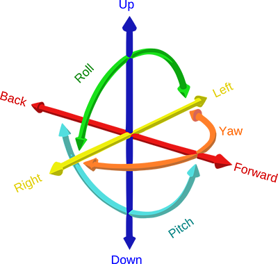
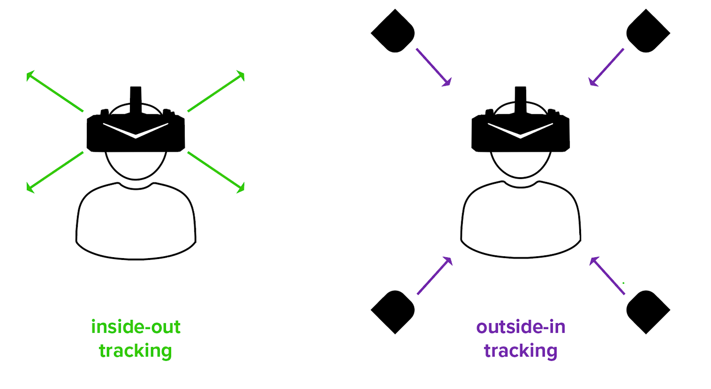
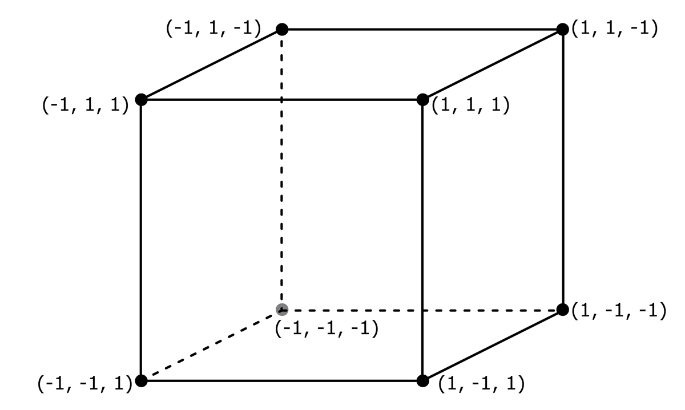
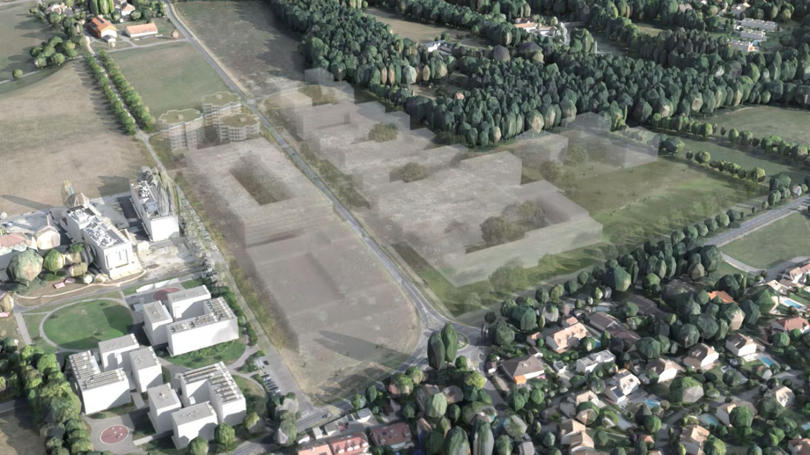
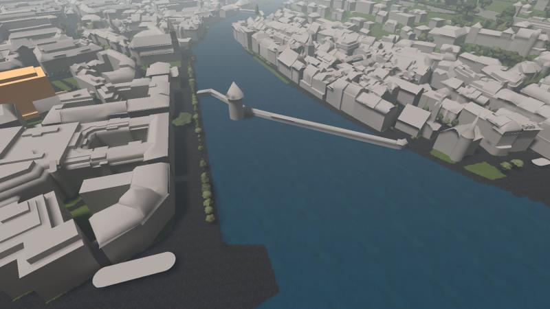

# Introduction à la VR

## Table des matières <!-- omit in toc -->

- [Introduction à la VR](#introduction-à-la-vr)
  - [Technologies VR](#technologies-vr)
    - [Degrés de liberté (DoF)](#degrés-de-liberté-dof)
    - [Suivi de position](#suivi-de-position)
    - [Contrôleurs et systèmes d'interaction](#contrôleurs-et-systèmes-dinteraction)
  - [Déplacements](#déplacements)
    - [Principales problématiques](#principales-problématiques)
    - [Déplacements et (cyber-)cinétose](#déplacements-et-cyber-cinétose)
      - [Téléportation](#téléportation)
      - [Simulateurs](#simulateurs)
      - [Déplacements libres](#déplacements-libres)
      - [Autres artifices](#autres-artifices)
  - [WebXR](#webxr)
    - [Positionnement dans l'espace](#positionnement-dans-lespace)
  - [Projets VR et géoinformation](#projets-vr-et-géoinformation)
    - [SITNVR](#sitnvr)
    - [Grands Esserts](#grands-esserts)
    - [Holodeck](#holodeck)

## Technologies VR
Les textes et concepts de ce chapitre sont tirés du [cours VR](https://github.com/Chabloz/VR-A-Frame/blob/master/EtatArt.md#hardware) de Nicolas Chabloz.

### Degrés de liberté (DoF)

Les degrés de liberté font référence au nombre et types de mouvements réalisables dans un espace 3D. En réalité virtuelle, il existe différentes possibilités :

Le **3DoF** pour "Three Degrees Of Freedom", qui indique que le matériel peut suivre les mouvements de rotation effectués par l'utilisateur (ces trois axes sont _yaw_, _pitch_ et _roll_).  

Le **6DoF** pour "Six Degrees Of Freedom" qui, en plus de pouvoir suivre les mouvements de rotation, peut également suivre les mouvements de translation (_forward/back_, _up/down_, _left/right_).

En général, le nombre de degrés de liberté du casque correspond à celui du contrôleur (quand il y en a un).

### Suivi de position

Le suivi de position (positional tracking) est possible aujourd'hui avec les 2 techniques ci-dessous :

- Outside-in (Oculus camera IR, Valve lighthouse…)
- Inside-out tracking (simultaneous localization and mapping [SLAM](https://en.wikipedia.org/wiki/Simultaneous_localization_and_mapping))

La première est externe au casque et la seconde est intégrée au casque. Bien que plus intéressante pour sa portabilité, la version _inside-out_ est souvent moins précise et il semble difficile qu'elle offre un jour un tracking du corps entier.

Pour aller plus loin sur leurs fonctionnements : [How VR Positional Tracking System Work](https://uploadvr.com/how-vr-tracking-works)

### Contrôleurs et systèmes d'interaction

La VR se démocratisant, de nouveaux systèmes permettant d'interagir émergent ou se répendent également. Voici quelques systèmes d'interactions possibles aujourd'hui :

- **Regard** (_gaze interaction_) : l'utilisateur·trice interagit avec un élément en le centrant dans sa vue (peut-être utiliser avec un minuteur).

- **Yeux** (_eye-tracking_) : certains casques permettent de suivre la direction des yeux.

- **Contrôleur 3DoF** : suivi des mouvements de rotation uniquement. Son usage en VR se limite à pouvoir pointer des objets comme les télécommandes des TV modernes, mais également à servir aux déplacements. Toutefois, certains contrôleurs peuvent simuler un 6DoF ([Documentation Unity](https://developers.google.com/vr/develop/unity/controller-support)).

- **Contrôleur 6DoF** : suivi des mouvement de rotation et de position (dans la main du joueur ou ailleurs). Cela permet d'avoir une immersion quasiment parfaite.

- **Mains** : une grande majorité de casques (en 2024), intégrent directement un système de suivi de la position des mains et des doigts de l'utilisateur·trice. Des modèles plus anciens utilisaient des capteurs supplémentaires (comme le [Leap Motion](https://en.wikipedia.org/wiki/Leap_Motion)).

- **Visage** : certains casques VR proposent également des fonctions de suivi du visage (_face tracking_) et de ses sous-parties, comme le suivi de la bouche (_mouth/lip tracking_) en autre.

Il existe bien sûr d'autres types de contrôleurs et capteurs plus exotiques, mais ceux-ci reprennent la plupart du temps l'un des principes ci-dessus pour fonctionner.

## Déplacements

Les textes et concepts de ce chapitre sont tirés du [cours VR](https://github.com/Chabloz/VR-A-Frame/blob/master/EtatArt.md#d%C3%A9placements) de Nicolas Chabloz.

### Principales problématiques

- **Cinétose** (_mal des transports_) : se produit la plupart du temps lorsque le déplacement visualisé est décalé de celui de l'utilisateur.

- **Espace restreint** : l'utilisateur n'a souvent qu'une petite partie de pièce (entre 1 et 3 m2), alors que l'espace virtuel est d'une taille quelconque.

- **Obstacles** : l'espace réel peut contenir des obstacles qui seront invisibles en VR. Pour le moment, quasi tous les systèmes VR utilisent un système de _chaperon_ qui permet de faire apparaître des murs virtuels prédéfinis dans l'espace VR lorsque l'utilisateur s'en approche.

### Déplacements et (cyber-)cinétose

Une des principales règles pour éviter ce problème et de ne jamais prendre le contrôle de la caméra (et donc de la laisser être contrôlée par le système de positionnement du casque VR).

Si l'on veut tout de même déplacer l'avatar de l'utilisateur (et donc sa caméra) dans la VR sans que celui-ci se déplace dans la réalité, il va falloir trouver des astuces pour le faire de la manière la plus confortable possible. Le critère de **confort** se retrouve d'ailleurs dans la plupart des magasins d'applications VR (par ex. dans [l'oculus store](https://support.oculus.com/1639053389725739/)). Voilà quelques exemples de solutions :

#### Téléportation
Elle ne provoque généralement pas d’inconfort, mais elle peut casser l’immersion si elle n'est pas _scénarisée_ dans l'application.

#### Simulateurs

Si les déplacements sont faits via un simulateur de véhicule (voitures, avions, vaisseaux spatiaux, etc.), les risques de _cinétose_ sont fortement réduits. En effet, le mal du voyage atteint rarement celui qui est maître du véhicule, mais plutôt ses passagers.

#### Déplacements libres

Pour éviter l'inconfort avec des déplacements libres, il est nécessaire d'utiliser des artifices. Le jeu [Raw Data](https://survios.com/rawdata/) utilise un système de _sprint_ (ou _dash_) très rapide et très proche de la téléportation. L'effet est quasi identique, mais brise moins l'immersion. Toutefois, pour que cela ne provoque pas trop la cinétose, la vision doit être floutée autour de la zone fovéale.

#### Autres artifices

Si l'espace VR est de taille identique (ou plus petit que l'espace réel), la solution est simple. Il suffit à l'utilisateur de se déplacer dans la réalité pour être déplacé dans la VR de manière identique en utilisant simplement le système de positionnement du casque.

Même si l'espace VR est plus grand que l'espace réel, il existe quelques méthodes (_astuces_) pour éviter de devoir déplacer la caméra de l'utilisateur ou d'utiliser des mécanismes de téléportation. En voici quelques-une :

- **Marche redirigée**: il s'agit de fausser la perception de l'esprit avec un décalage des mouvements réels/virtuels ([Redirect walking](https://www.youtube.com/watch?v=XOxmMurUv3Q)).

- **Suites de mouvements adaptées à l'univers** : pensés pour que l'utilisateur revienne sur ses pas, et reste dans un espace restreint (identique à son espace réel). Ce peut être fait avec l'utilisation d'ascenseurs, des techniques de chevauchement d'espaces (voir image), ou autres astuces (désorientations, distances faussées, etc.). L’expérience [Unseen Diplomacy](https://store.steampowered.com/app/429830/Unseen_Diplomacy/) reprend quelques-unes de ces idées.

- **_Drag and drop_** : Dans l'application [Google Earth VR](https://arvr.google.com/earth/), au lieu de téléporter l'utilisateur vers sa destination, on effectue un "drag" de la destination jusqu'à sa position désirée, ainsi l'utilisateur ne bouge pas, mais c'est la terre qui bouge sous ses pieds ([Chuck Norris facts !](https://www.youtube.com/watch?v=s8uS2maPAZM)).

Bien sûr, les techniques décrites précédemment peuvent être combinées.

## WebXR

WebXR est un groupe de standard et une API conçus pour supporter la VR et l'AR sur le web. Cette technologie utilise WebGL pour ses rendus 3D.

### Positionnement dans l'espace

WebXR utilise un système de coordonnées cartésien en mètres et représente le monde comme un cube de 2m x 2m dont l'origine est au centre. 

Ce système local est appelé _espace de référence_ et est calculé à partir d'un espace donné (en l'occurence, l'environnement de l'utilisateur).

Si vous voulez allez plus loin, n'hésitez pas à lire [Geometry and reference spaces in WebXR](https://developer.mozilla.org/en-US/docs/Web/API/WebXR_Device_API/Geometry) et [WebGL model view projection](https://developer.mozilla.org/en-US/docs/Web/API/WebGL_API/WebGL_model_view_projection)

<!-- Pour positionner les différents éléments d'une scène 3D, cette technologie utilise des espaces de références. Ceux-ci mettent en place des systèmes de coordonnées locales calculées à partir d'espaces donnés. Ces espaces de références sont notamment utilisés pour définir l'espace monde (soit l'environnement 3D global), la caméra (tête) et les mains de l'utilisateur, et le rayon utilisé pour les interactions. -->

## Projets VR et géoinformation

Pour vous donner une idée de ce qui a déjà été fait et ce qu'il est possible de faire, voici quelques exemples de projets mélangeant ces 2 projets.

### SITNVR

Prototype de jeu permettant d'importer des données GIS comme des bâtiments et des arbres, et de les placer dans un environnement VR. Réalisé sur Unity pour le [SITN](https://sitn.ne.ch/theme/main?lang=fr&map_x=2550050&map_y=1205000&map_zoom=1&baselayer_ref=blank&tree_groups=gp_points_interets%2Cgp_photos_360%2Cgp_main%2Cgp_base_layers&tree_group_layers_gp_photos_360=&tree_group_layers_gp_main=).

[Démo Youtube](https://www.youtube.com/watch?v=ZIx7gUyjmtI)

### Grands Esserts

Visualisation du projet d'urbanisme des Grands Esserts (GE) par [Pixalab](https://pixalab.ch/).

[Démo Youtube](https://www.youtube.com/watch?v=mGHDX2Kmpd0&t=8s)

### Holodeck

Projet de recherche de la HSLU qui visait à étudier la pertinence de l'utilisation de la VR et l'AR comme moyen de communication dans l'urbanisme.

---

[Chapitre suivant : Base de A-Frame](Base-A-Frame.md)