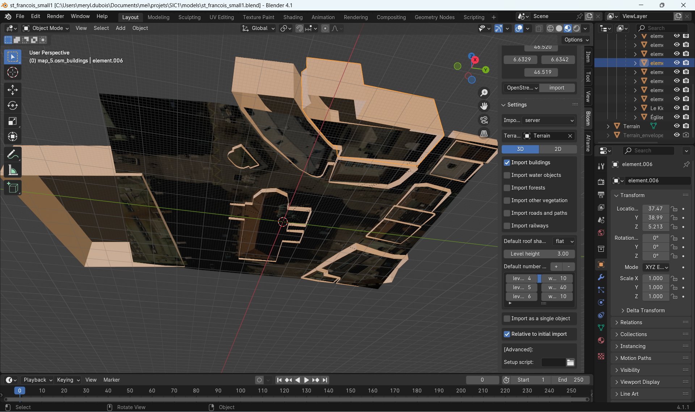

# Exercice pratique

## Importation d'assets géographiques

Afin d'utiliser le format 3D compatible avec A-Frame (gltf/glb), vous allez créer des assets via Blender et l'add-on BLOSM, vus précédemment avec Cesium.

### Installation

Si ce n'est donc pas déjà fait, installez [Blender](https://www.blender.org/download/) et [BLOSM](https://prochitecture.gumroad.com/l/blender-osm). Dans Blender, vous pouvez accéder à l'add-on en affichant la barre latérale de la vue (_View > Sidebar_ ou touche _n_).

### Création de l'asset avec OSM

Comme pour Césium, il est possible d'utiliser les données d'OSM pour créer des environnements 3D. En utilisant le plugin, vous allez importez les éléments suivants (dans l'ordre).

- __Terrain :__ utilisez les boutons `select` and `paste` pour sélectionner une zone de votre choix. Sélectionnez une zone de max 0.2 x 0.2 km pour éviter un nettoyage trop chronophage du modèle.

- __Image overlay :__ vérifiez que votre terrain précédemment chargé soit sélectionné dans l'option Terrain. Utilisez l'overlay "OSM Mapnik". (changez le _viewport shading_ pour voir les matériaux).

- __OpenStreetMap :__ importez depuis le serveur (seuls les bâtiments suffisent) et déselectionnez la case "import as a single object".

(Optionnel) Une fois ces éléments chargés, procédez à un nettoyage rapide des bâtiment. En effet, si votre terrain à un peu de déniveler, certaines parties de bâtiment peuvent ne pas toucher le sol et il sera donc possible de voir "en-dessous" en VR. Descendez ainsi la position z de vos bâtiments pour que tous les murs touchent le sol.

### Exportation au format .glb

 Exportez ensuite votre scène via _File > Export > glTF 2.0_ et sélectionnez le format `.glb` dans la boîte de dialogue. Enregistrez-le ou copiez-le dans le dossier _public > assets_ de l'app.

### Importation du modèle

Ouvrez `TheScene` et intégrez le modèle comme vu dans la partie précédente en utilisant le preloader. Positionnez-le de façon à ce que vous soyez dans une rue au chargement (et non dans un bâtiment ou dans un mur) et que le terrain soit au niveau du sol. Ajustez également l'échelle pour que les bâtiments aient la bonne taille.

## (Optionel) Ajout du ciel

Si vous le souhaitez, ajoutez un ciel à votre scène avec une image 360 de votre choix. Vous pouvez également utiliser l'image mise à disposition dans les assets du boilerplate.

## Déplacements

### Limite des déplacements

Jusqu'à maintenant, rien ne vous empêchait de traverser les murs des bâtiments. Afin d'éviter cela, vous allez ajouter un navmesh, délimitant les zone de déplacement possibles. Utilisez des plans pour dessiner la zone dans laquelle l'utilisateur peut se déplacer. Cela peut être fait de 2 façons différentes :

- Par addition : placez des plans les uns à côtés des autres pour dessiner les rues, en évitant les bâtiments. Donnez-leur un identifiant commun (class ou data attribute).
- Par soustraction : utilisez un grand plan qui couvre toute la zone, puis ajoutez des plans aux endroits ou se trouvent les bâtiments. Ces plans seront par la suite soustraits, créant ainsi des "trous" dans le plan principal. Donnez un identifiant communs aux "trous", différent du plan principal.

Ces techniques peuvent bien entendu être combinées. Une fois votre navmesh dessiné, utilisez le composant A-Frame _simple navmesh constraint_ fourni avec le boilerplate (_src > aframe_) sur l'entité portant la camera (#head) du camera rig. Passez-lui les propriétés :

- `navmesh` : sélecteur css du navmesh.
- `height` : hauteur de votre caméra (1.65 si vous n'y avez pas touché dans l'entité #head).
- `exlude` : sélecteur css des plans à soustraire du navmesh (trous).

<!-- Ajoutez également le composant suivant à votre entité #head :

    disable-in-vr="component: simple-navmesh-constraint;"

Le navmesh n'est en effet pas nécessaire en VR, car les      -->

### Téléportation

Comme la zone VR est plus grande que l'espace réel disponible, vous allez utiliser le composant _blink-controls_ également fourni dans le boilerplate pour permettre à l'utilisateur de se téléporter.

Placez le blink-controls dans la main gauche du camera rig (et non la "dummy-hand" qui permet de simuler la main en flat 3D). Ajoutez-lui les propriétés suivantes :

- `cameraRig` : sélecteur css du camera rig (normalement `#camera-rig` si vous ne l'avez pas changé).
- `teleportOrigin` : sélecteur css de l'entité à laquelle est liée la caméra (#head).
- `collisionEntities` : sélecteur css du navmesh.
- `button` : bouton à presser pour se téléporter. À choix entre trackpad, trigger, grip, menu ou thumbstick.
- `snapTurn` : mettre à false (peu engendrer la cynétose).

# Autres outils

Les outils suivants pourraient potentiellement être intéressants, mais ne fonctionnent pas en l'état.

- [aframe-loader-3dtiles-component](https://github.com/nytimes/aframe-loader-3dtiles-component) : permet de charger des tuiles 3D Cesium et Google. Bug : tuiles chargées mais invisibles.
- [aframe_blender_exporter](https://github.com/silverslade/aframe_blender_exporter) : pour exporter directement une scène A-Frame depuis Blender. Bug : crash du script Python.

